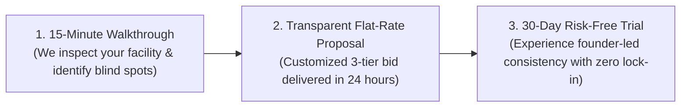

# Capability Statement & Complete Website Copy

---

# Part 1: Official 1-Page Government & Corporate Capability Statement (PDF Layout)

*(Designed for standard 8.5" x 11" one-page PDF format for submission to Government Contracting Officers and Corporate Supplier Diversity Directors)*

```
========================================================================================================
[ LOGO ]               GOLDEN CREST COMMERCIAL SANITATION GROUP
                       Hospitality-Trained | Health-Compliance Certified | 100% Black Women-Owned
========================================================================================================

COMPANY OVERVIEW
Golden Crest Commercial Sanitation Group is a premier, 100% Black women-owned commercial facilities and 
sanitation contractor. Founded and led by certified Food & Beverage compliance managers from tier-one 
casino and resort operations, we deliver hospitality-grade aesthetics, audit-strict cross-contamination 
prevention, and reliable day/night commercial janitorial solutions for government, healthcare, and 
corporate facilities.

--------------------------------------------------------------------------------------------------------
CORE COMPETENCIES                                      COMPANY DATA & CODES
• Commercial Janitorial & Custodial Services            • Entity Type: 100% Black Women-Owned LLC
• Healthcare & Medical Suite Sanitation Protocols      • Primary NAICS: 561720 (Janitorial Services)
• Hospitality-Grade Restroom Deep Disinfection          • Secondary NAICS:
• 4-Zone Color-Coded Microfiber Cross-Contamination       - 561740 (Carpet & Upholstery Cleaning)
  Prevention Protocol                                     - 561790 (Other Services to Buildings)
• Post-Turnover & Event Deep Clean Services               - 561210 (Facilities Support Services)
• High-Touch Surface Disinfection (EPA-Registered)      • Primary PSC: S201 (Housekeeping - Custodial)
• Green Seal Certified Eco-Friendly Products            • CAGE Code: [Pending/Active]
                                                        • UEI: [12-Digit SAM.gov Identifier]
--------------------------------------------------------------------------------------------------------
DIFFERENTIATORS                                         CERTIFICATIONS & CREDENTIALS
• 15+ Years Casino & F&B Management Leadership:        • WBE (Women's Business Enterprise) Eligible
  Trained under relentless health inspection            • MBE (Minority Business Enterprise) Eligible
  and high-volume public safety standards.              • WOSB / EDWOSB (Federal Set-Aside Ready)
• 100% Founder Quality Inspections: Every contract      • ServSafe Manager Certified (Health Compliance)
  is overseen directly by managing partners.            • General Liability & Property Damage Insured
• Rapid Response Guarantee: Dedicated direct partner    • Bonded & Background-Screened Staffing
  cell access with 2-hour issue resolution.
--------------------------------------------------------------------------------------------------------
PAST LEADERSHIP & RELEVANT EXPERIENCE                   CONTACT INFORMATION
• Oversight of 24/7 sanitation operations in            Managing Partners: Miesha & Kimberly
  50,000+ sq. ft. commercial hospitality facilities.    Phone: (XXX) XXX-XXXX
• Flawless compliance records on state/local            Email: info@goldencrestfacilities.com
  Department of Health audits.                          Website: www.goldencrestfacilities.com
• Management of multi-shift sanitation personnel.       Service Area: [Metropolitan Region / Statewide]
========================================================================================================
```

---

# Part 2: Complete Word-for-Word Website Landing Page Copy

### 1. Navigation Header
* **Logo:** Golden Crest Facilities Group *(or K&M Facilities Group)*
* **Left Subtitle:** *Hospitality-Grade Commercial Sanitation*
* **Center Navigation:** Services | The Founder Standard | Diversity & Government | Free Audit
* **Right Badges & CTA:** 
  * `[WBE / MBE Certified]` `[ServSafe Certified]`
  * `[Button: Request 15-Minute Audit]`

---

### 2. Hero Section
* **Pre-Header Tag:** `100% FOUNDER-LED • WOMEN-OWNED ENTERPRISE (MWBE)`
* **Main Headline:**  
  # Hospitality-Grade Commercial Cleaning.  
  # Managed by Certified Casino & Health Compliance Leaders.
* **Sub-Headline:**  
  Say goodbye to missed trash, dirty baseboards, and revolving-door franchise cleaners. Miesha and Kimberly bring five-star hospitality standards and audit-ready precision to medical suites, corporate headquarters, and government facilities.
* **Primary CTA Button:** `[ Book a Free 15-Minute Facility Walkthrough & Sanitation Audit ]`
* **Secondary Link:** `[ Download Official Corporate Capability Statement (PDF) ↓ ]`

---

### 3. Trust & Certification Banner
*(Displayed directly beneath the hero in sleek platinum & gold badges)*
* `[ 100% Black Women-Owned Enterprise ]`
* `[ ServSafe Health & Sanitation Certified ]`
* `[ Licensed, Bonded & Insured ($2,000,000 Policy) ]`
* `[ SAM.gov Registered • CAGE Active ]`

---

### 4. The Problem vs. The Golden Crest Standard
* **Section Title:** *Why Most Commercial Cleaning Falls Short*
* **Intro:** *Most corporate facilities are tired of large national franchises that subcontract to the lowest bidder and never show up when problems arise.*

| What You Get From Standard Franchises | The Golden Crest Standard |
| :--- | :--- |
| ❌ High turnover cleaners who rush through rooms | ✅ **Cleaned and inspected directly by founding partners** |
| ❌ Same mop & rags used across bathrooms and desks | ✅ **Strict 4-Zone color-coded cross-contamination protocol** |
| ❌ Impersonal 1-800 call center when issues happen | ✅ **Direct mobile line to Miesha & Kimberly with 2-hour response** |
| ❌ Surface-level dusting that fails close inspection | ✅ **Hospitality & casino health-inspection checklist every visit** |

---

### 5. Specialized Industries We Serve

#### A. Medical, Dental & MedSpa Suites
* *Clinical precision with patient-facing elegance.*
* EPA-registered hospital-grade disinfectants, exam room sanitization, waiting room pristine presentation, and zero cross-contamination.

#### B. Corporate Headquarters & Professional Practices
* *Pristine workspaces that impress high-value clients.*
* Boardroom detailing, executive washroom deep cleaning, kitchen/breakroom sanitization, and evening trash/recycling management.

#### C. High-Traffic Venues & Hospitality Facilities
* *Built on casino & resort leadership experience.*
* High-volume restroom turnovers, entryway glass and floor care, dining area sanitization, and event prep/turnover.

#### D. Government & Municipal Facilities
* *Compliant, secure, and ready for public sector delivery.*
* SAM.gov registered, NAICS 561720, background-checked personnel, meeting federal WOSB and municipal MWBE diversity spend requirements.

---

### 6. Corporate Supplier Diversity & Government Procurement Section
* **Headline:** *Empowering Your Tier-1 and Tier-2 Supplier Diversity Spend.*
* **Body Text:**  
  As a certified Minority and Women-Owned Business Enterprise (MWBE), Golden Crest partners with corporate procurement directors, prime contractors, and government agencies seeking uncompromising janitorial quality while meeting diversity participation goals.
* **Key Procurement Data:**
  * **Primary NAICS:** 561720 (Janitorial Services)
  * **PSC Code:** S201 (Housekeeping - Custodial)
  * **DUNS / UEI & CAGE:** Available upon request
* **CTA Button:** `[ Request Government / Corporate RFP Bid Package ]`

---

### 7. The 3-Step Simple Onboarding Process



---

### 8. Interactive Lead Capture & Audit Booking Form
* **Form Header:** *Request Your Complimentary 15-Minute Facility Cleanliness Audit*
* **Fields:**
  * `Full Name:`
  * `Company / Facility Name:`
  * `Facility Type:` *(Dropdown: Medical/Dental, Corporate Office, MedSpa, Government/Municipal, Other)*
  * `Approximate Square Footage:` *(Dropdown: Under 3,000 sq ft, 3,000 - 8,000 sq ft, 8,000+ sq ft)*
  * `Cleaning Frequency Needed:` *(Dropdown: 2-3 Nights/Week, 5 Nights/Week, Weekend Only, Deep Clean/One-Time)*
  * `Phone Number & Email Address:`
  * `Best Time for Walkthrough:` *(Date & Time Picker)*
* **Submit Button:** `[ Submit & Get My Custom Proposal ]`
* **Footer Disclaimer:** *100% confidential. No spam. Direct response from founders within 2 hours.*
