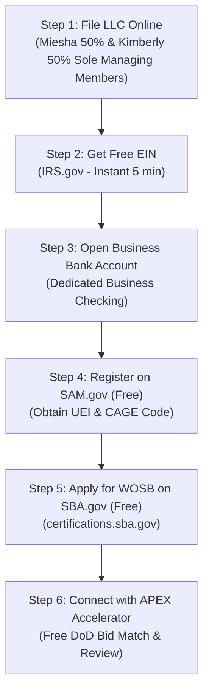

# Master Strategic Blueprint: Golden Crest Commercial Sanitation & Government Contracting

**Company Name:** Golden Crest Commercial Cleaning & Facilities  
**Entity Structure:** 100% Black Women-Owned LLC (Miesha & Kimberly — 50/50 Managing Members)  
**Business Development & Government Prospecting Lead:** Husband (Operating in service of the founders)  
**Primary NAICS Code:** `561720` (Janitorial Services)  
**Primary PSC Code:** `S201` (Housekeeping - Custodial Janitorial)  

---

## 1. Complete Business Context & Founding Team

### The Founders & Leadership:
* **Miesha (Co-Founder & Managing Member - 50% Ownership):** 
  * Food & Beverage Manager at a major casino property (near Director level).
  * Holds ServSafe certification; built a career around strict compliance, zero-failure health inspections, and high-volume operations.
* **Kimberly (Co-Founder & Managing Member - 50% Ownership):** 
  * Supervisor in high-volume casino hospitality operations.
  * Expert in shift management, team accountability, and quality standards.
* **Husband (Business Development & Proposal Lead):** 
  * Handles technology, SAM.gov monitoring, RFP tracking, municipal vendor registrations, and relationship building with facility managers and Contracting Officers.

### Day 1 Operating Model:
* **Bootstrapped & Hands-On:** Founders begin by performing the initial commercial accounts directly to establish standard operating procedures (SOPs) before onboarding and training dedicated crew members.
* **Zero Paid Advertising Strategy:** Growth is driven 100% through direct outreach, municipal vendor registries (City, County, School Districts), and government contracting (SAM.gov & APEX Accelerators).
* **Ethical Positioning:** The company is positioned on **excellence, hospitality standards, and compliance**—never framed as "chasing set-aside loopholes."

---

## 2. Verified 2026 Government Contracting Strategy & Rules

```
                           ┌───────────────────────────────────────────────┐
                           │      ACCOUNT-BASED PROSPECTING ENGINE         │
                           └───────────────────────────────────────────────┘
                                                   │
             ┌─────────────────────────────────────┼─────────────────────────────────────┐
             ▼                                     ▼                                     ▼
     1. SAM.GOV FEDERAL                    2. MICRO-PURCHASES                    3. LOCAL MUNICIPALITIES
     • NAICS 561720 / PSC S201             • Contracts < $15,000                 • County Courthouses
     • Simplified Acq (<$350k)             • Swiped on Gov Purchase Card         • School Districts & Colleges
     • Free APEX Proposal Review           • Zero public bidding required        • City Facilities & Housing Dept
```

### Key Federal Rules & Thresholds (Fact-Checked for 2026):
1. **Micro-Purchase Threshold is $15,000:** 
   * Federal agencies can swipe their Government Purchase Card (GPC) for janitorial jobs under $15,000 with zero public bid.
   * *Targets:* Local National Guard armories, Social Security branch offices, Army/Navy recruiting stations, FAA radar towers, federal park facilities.
2. **Simplified Acquisition Threshold is $350,000:** 
   * Federal contracts between $15,000 and $350,000 are automatically reserved for small businesses under FAR Part 19.
3. **WOSB Federal Certification ($0 Free):** 
   * Third-party self-certification was eliminated by Congress. Official WOSB certification is done 100% free through the SBA at [certifications.sba.gov](https://certifications.sba.gov).
4. **APEX Accelerators ($0 Free):** 
   * DoD-funded business counseling centers ([apexaccelerators.us](https://www.apexaccelerators.us)) assign you a dedicated counselor who reviews your bid pricing and compliance for free before submission.
5. **Corporate Diversity Programs (Phase 2):** 
   * Do not pay for WBENC ($350) or NMSDC during the startup phase. Conserve cash flow and pursue them after achieving 3–6 months of steady commercial revenue.
6. **SBA 8(a) Program:** 
   * Target for Year 2 or 3 once the LLC has 2 years of filed business tax returns.

---

## 3. Step-by-Step Legal & Government Registration Roadmap



1. **LLC Filing ($50–$300 State Fee):** File Articles of Organization with Secretary of State. Miesha & Kimberly listed as 100% owners/managing members to protect WOSB/EDWOSB eligibility.
2. **EIN ($0 Free):** Apply on [IRS.gov](https://www.irs.gov).
3. **Business Checking ($0):** Open dedicated account.
4. **SAM.gov ($0 Free):** Register entity for federal database, receive Unique Entity Identifier (UEI) and CAGE Code.
5. **WOSB Application ($0 Free):** Submit required LLC docs at `certifications.sba.gov`.
6. **APEX Accelerator Intake ($0 Free):** Meet local counselor to set up automated local/federal bid notifications.

---

## 4. Master File Directory in this Repository

| File | Role | Context & Review Points for Hermes |
| :--- | :--- | :--- |
| `index.html` | **Customer & Government Landing Page** | High-conversion landing page styled in modern Electric Purple & Rose Quartz on crisp white. Features SpaceDrop™ photo uploader, access protocol selector, QR checkpoint tech, and ethical Government Bids section (NAICS 561720). |
| `master_business_and_contracting_plan.md` | **Master Blueprint & Strategy** | This document. Complete strategic, legal, and operational context for all agents. |
| `capability_statement_and_website_copy.md` | **1-Page Capability Statement PDF Text** | The standard 1-page PDF fact sheet to email directly to Federal Contracting Officers and Small Business Specialists. |
