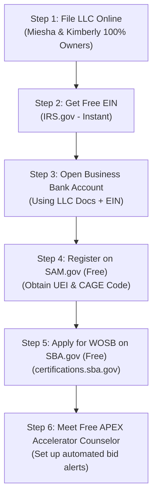

# Master Blueprint: Business Registration & Government Contracting Playbook

**Company Name:** Golden Crest Commercial Cleaning (or K&M Facilities Group)  
**Ownership Structure:** 100% Black Women-Owned LLC (Miesha & Kimberly)  
**Business Development & Prospecting Lead:** Husband  
**Primary NAICS Code:** `561720` (Janitorial Services)  
**Primary PSC Code:** `S201` (Housekeeping - Custodial Janitorial)  

---

## 1. Master File Directory (For You & Any Future Agent)

All project files are saved and persisted in this directory:
`C:\Users\lenovo\.gemini\antigravity\brain\4395a0d5-0261-4a88-a8b4-ceebfc174beb\`

| File Name | Purpose |
| :--- | :--- |
| [`master_business_and_contracting_plan.md`](file:///C:/Users/lenovo/.gemini/antigravity/brain/4395a0d5-0261-4a88-a8b4-ceebfc174beb/master_business_and_contracting_plan.md) | **The Master Strategy & Legal Blueprint:** Complete guide covering business setup, ownership structuring, government thresholds, and compliance. |
| [`capability_statement_and_website_copy.md`](file:///C:/Users/lenovo/.gemini/antigravity/brain/4395a0d5-0261-4a88-a8b4-ceebfc174beb/capability_statement_and_website_copy.md) | **1-Page Government Capability Statement:** PDF-ready text for Contracting Officers + complete written copy for marketing. |
| [`landing_page_preview.html`](file:///C:/Users/lenovo/.gemini/antigravity/brain/4395a0d5-0261-4a88-a8b4-ceebfc174beb/landing_page_preview.html) | **Live Website:** Interactive, high-converting customer landing page (Apple x Golden Girls aesthetic with zero brown). |

---

## 2. Step-by-Step Registration Roadmap (In Exact Order)



### Phase 1: Legal Entity Setup ($50–$300 State Fee Only)
1. **File LLC:** Register online with your state's Secretary of State.
   * *Critical Rule:* Miesha and Kimberly must be listed as the sole Managing Members (50/50 ownership) to qualify for all minority and women-owned set-asides.
2. **Get EIN ($0 Free):** Go to [IRS.gov](https://www.irs.gov) and apply for an Employer Identification Number. Takes 5 minutes and is issued instantly.
3. **Open Business Checking Account ($0):** Bring the LLC filing and EIN to a local bank or credit union. 

### Phase 2: Government Vendor Registration ($0 Free)
4. **SAM.gov Registration:**
   * Go to the official [SAM.gov](https://sam.gov) portal.
   * Register the entity to get your **UEI (Unique Entity Identifier)** and **CAGE Code**.
   * Select Primary NAICS: `561720` (Janitorial Services) and PSC `S201`.
5. **SBA WOSB Certification ($0 Free):**
   * Once SAM.gov is active, submit for **Women-Owned Small Business (WOSB)** certification at [certifications.sba.gov](https://certifications.sba.gov).
   * This is legally protected and allows access to federal contracts set aside exclusively for women-owned businesses.
6. **Connect with APEX Accelerators ($0 Free):**
   * Visit [apexaccelerators.us](https://www.apexaccelerators.us) to find your regional office.
   * Schedule a 1-on-1 meeting. Your counselor is a free government employee whose job is to help you win bids.

---

## 3. The Husband Prospector & Contracting Playbook

You do not need advertising dollars. You are running an **Account-Based Government & Municipal Relationship Engine**.

```
                           ┌───────────────────────────────────────────────┐
                           │         YOUR DAILY PROSPECTING SYSTEM         │
                           └───────────────────────────────────────────────┘
                                                   │
             ┌─────────────────────────────────────┼─────────────────────────────────────┐
             ▼                                     ▼                                     ▼
     1. SAM.GOV OPPORTUNITIES              2. MICRO-PURCHASES                    3. LOCAL MUNICIPALITIES
     • Search NAICS 561720                 • Jobs under $15,000                  • County Courthouse
     • Filter by WOSB & Small Business     • Swiped on Gov Purchase Card         • School Districts
     • Review with APEX before bidding     • No formal bidding required          • City Hall & Transit Authority
```

### Strategy A: The Under-$15,000 Micro-Purchase Pipeline
* Federal agencies can hire vendors for contracts **under $15,000** without putting them out for competitive public bid.
* **Target:** Local National Guard armories, Army/Navy recruiting stations, Social Security branch offices, FAA towers, and federal park facilities.
* **Your Action:**
  1. Identify the **Small Business Specialist (SBS)** or **Facility Manager** at local federal offices.
  2. Send them your [1-Page Capability Statement PDF](file:///C:/Users/lenovo/.gemini/antigravity/brain/4395a0d5-0261-4a88-a8b4-ceebfc174beb/capability_statement_and_website_copy.md).
  3. Inform them you are an active, SAM.gov-registered, WOSB-eligible vendor ready for immediate facility maintenance or turnover deep cleans.

### Strategy B: Simplified Acquisition Bids ($15,000 to $350,000)
* Contracts between **$15,000 and $350,000** are automatically set aside for small businesses.
* When a janitorial solicitation posts on SAM.gov in your metro area:
  1. Download the Statement of Work (SOW).
  2. Attend the mandatory or optional on-site walkthrough.
  3. Draft your 3-to-5 page price proposal.
  4. **Email your draft to your APEX Accelerator counselor** — they review your pricing and compliance for free before you submit.

### Strategy C: Local City & County Government Portals (Fastest Local Wins)
* Federal SAM.gov is massive, but **your City Purchasing Department, County Board of Education, and County Courthouse** issue recurring 1-year to 3-year cleaning RFPs constantly.
* Register directly on your City and County vendor registries (100% free).

---

## 4. Phase 2 (Once You Have Revenue): Corporate Diversity Certifications

Do not spend money on these today. Pursue them after you have your first 3–6 months of operating cashflow:

* **NMSDC (National Minority Supplier Development Council):** For corporate supplier diversity lists (Marriott, Delta, Amazon, banking headquarters).
* **WBENC (Women's Business Enterprise National Council):** $350 application fee — opens Fortune 500 corporate supplier matchmaking events.
* **SBA 8(a) Program:** Target for **Year 2 or 3** once the LLC has 2 years of tax returns.
